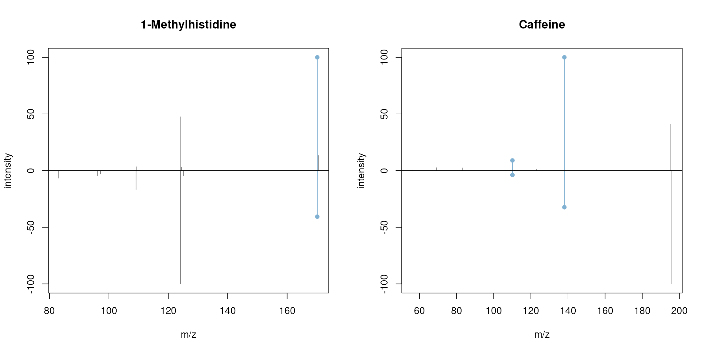

# Description and usage of Spectra objects

**Package**:
*[Spectra](https://bioconductor.org/packages/3.23/Spectra)*  
**Authors**: RforMassSpectrometry Package Maintainer \[cre\], Laurent
Gatto \[aut\] (ORCID: <https://orcid.org/0000-0002-1520-2268>), Johannes
Rainer \[aut\] (ORCID: <https://orcid.org/0000-0002-6977-7147>),
Sebastian Gibb \[aut\] (ORCID: <https://orcid.org/0000-0001-7406-4443>),
Philippine Louail \[aut\] (ORCID:
<https://orcid.org/0009-0007-5429-6846>), Jan Stanstrup \[ctb\] (ORCID:
<https://orcid.org/0000-0003-0541-7369>), Nir Shahaf \[ctb\], Mar
Garcia-Aloy \[ctb\] (ORCID: <https://orcid.org/0000-0002-1330-6610>),
Guillaume Deflandre \[ctb\] (ORCID:
<https://orcid.org/0009-0008-1257-2416>), Ahlam Mentag \[ctb\] (ORCID:
<https://orcid.org/0009-0008-5438-7067>)  
**Last modified:** 2025-12-23 13:01:48.121851  
**Compiled**: Tue Dec 23 13:22:10 2025

## Introduction

The *[Spectra](https://bioconductor.org/packages/3.23/Spectra)* package
provides a scalable and flexible infrastructure to represent, retrieve
and handle mass spectrometry (MS) data. The `Spectra` object provides
the user with a single standardized interface to access and manipulate
MS data while supporting, through the concept of exchangeable
*backends*, a large variety of different ways to store and retrieve mass
spectrometry data. Such backends range from mzML/mzXML/CDF files, simple
flat files, or database systems.

This vignette provides general examples and descriptions for the
*Spectra* package. Additional information and tutorials are available,
such as
[SpectraTutorials](https://jorainer.github.io/SpectraTutorials/),
[MetaboAnnotationTutorials](https://jorainer.github.io/MetaboAnnotationTutorials),
or also in (Rainer et al. 2022). For information on how to handle and
(parallel) process large-scale data sets see the *Large-scale data
handling and processing with Spectra* vignette.

## Installation

The package can be installed with the *BiocManager* package. To install
*BiocManager* use `install.packages("BiocManager")` and, after that,
`BiocManager::install("Spectra")` to install *Spectra*.

## General usage

Mass spectrometry data in `Spectra` objects can be thought of as a list
of individual spectra, with each spectrum having a set of variables
associated with it. Besides *core* spectra variables (such as MS level
or retention time) an arbitrary number of optional variables can be
assigned to a spectrum. The core spectra variables all have their own
accessor method and it is guaranteed that a value is returned by it (or
`NA` if the information is not available). The core variables and their
data type are (alphabetically ordered):

- *acquisitionNum* `integer(1)`: the index of acquisition of a spectrum
  during a MS run.
- *centroided* `logical(1)`: whether the spectrum is in profile or
  centroid mode.
- *collisionEnergy* `numeric(1)`: collision energy used to create an MSn
  spectrum.
- *dataOrigin* `character(1)`: the *origin* of the spectrum’s data,
  e.g. the mzML file from which it was read.
- *dataStorage* `character(1)`: the (current) storage location of the
  spectrum data. This value depends on the backend used to handle and
  provide the data. For an *in-memory* backend like the
  `MsBackendDataFrame` this will be `"<memory>"`, for an on-disk backend
  such as the `MsBackendHdf5Peaks` it will be the name of the HDF5 file
  where the spectrum’s peak data is stored.
- *intensity* `numeric`: intensity values for the spectrum’s peaks.
- *isolationWindowLowerMz* `numeric(1)`: lower m/z for the isolation
  window in which the (MSn) spectrum was measured.
- *isolationWindowTargetMz* `numeric(1)`: the target m/z for the
  isolation window in which the (MSn) spectrum was measured.
- *isolationWindowUpperMz* `numeric(1)`: upper m/z for the isolation
  window in which the (MSn) spectrum was measured.
- *msLevel* `integer(1)`: the MS level of the spectrum.
- *mz* `numeric`: the m/z values for the spectrum’s peaks.
- *polarity* `integer(1)`: the polarity of the spectrum (`0` and `1`
  representing negative and positive polarity, respectively).
- *precScanNum* `integer(1)`: the scan (acquisition) number of the
  precursor for an MSn spectrum.
- *precursorCharge* `integer(1)`: the charge of the precursor of an MSn
  spectrum.
- *precursorIntensity* `numeric(1)`: the intensity of the precursor of
  an MSn spectrum.
- *precursorMz* `numeric(1)`: the m/z of the precursor of an MSn
  spectrum.
- *rtime* `numeric(1)`: the retention time of a spectrum.
- *scanIndex* `integer(1)`: the index of a spectrum within a (raw) file.
- *smoothed* `logical(1)`: whether the spectrum was smoothed.

For details on the individual variables and their getter/setter function
see the help for `Spectra`
([`?Spectra`](https://rformassspectrometry.github.io/Spectra/reference/Spectra.md)).
Also note that these variables are suggested, but not required to
characterize a spectrum. Also, some only make sense for MSn, but not for
MS1 spectra.

### Creating `Spectra` objects

The simplest way to create a `Spectra` object is by defining a
`DataFrame` with the corresponding spectra data (using the corresponding
spectra variable names as column names) and passing that to the
`Spectra` constructor function. Below we create such an object for a set
of 3 spectra providing their MS level, olarity but also additional
annotations such as their ID in [HMDB](http://hmdb.ca) (human metabolome
database) and their name. The m/z and intensity values for each spectrum
have to be provided as a `list` of `numeric` values.

``` r

library(Spectra)

spd <- DataFrame(
    msLevel = c(2L, 2L, 2L),
    polarity = c(1L, 1L, 1L),
    id = c("HMDB0000001", "HMDB0000001", "HMDB0001847"),
    name = c("1-Methylhistidine", "1-Methylhistidine", "Caffeine"))

## Assign m/z and intensity values.
spd$mz <- list(
    c(109.2, 124.2, 124.5, 170.16, 170.52),
    c(83.1, 96.12, 97.14, 109.14, 124.08, 125.1, 170.16),
    c(56.0494, 69.0447, 83.0603, 109.0395, 110.0712,
      111.0551, 123.0429, 138.0662, 195.0876))
spd$intensity <- list(
    c(3.407, 47.494, 3.094, 100.0, 13.240),
    c(6.685, 4.381, 3.022, 16.708, 100.0, 4.565, 40.643),
    c(0.459, 2.585, 2.446, 0.508, 8.968, 0.524, 0.974, 100.0, 40.994))

sps <- Spectra(spd)
sps
```

    ## MSn data (Spectra) with 3 spectra in a MsBackendMemory backend:
    ##     msLevel     rtime scanIndex
    ##   <integer> <numeric> <integer>
    ## 1         2        NA        NA
    ## 2         2        NA        NA
    ## 3         2        NA        NA
    ##  ... 18 more variables/columns.

Alternatively, it is possible to import spectra data from mass
spectrometry raw files in mzML/mzXML or CDF format. Below we create a
`Spectra` object from two mzML files and define to use a `MsBackendMzR`
backend to *store* the data (note that this requires the
*[mzR](https://bioconductor.org/packages/3.23/mzR)* package to be
installed). This backend, specifically designed for raw MS data, keeps
only a subset of spectra variables in memory while reading the m/z and
intensity values from the original data files only on demand. See
section [Backends](#backends) for more details on backends and their
properties.

``` r

fls <- dir(system.file("sciex", package = "msdata"), full.names = TRUE)
sps_sciex <- Spectra(fls, source = MsBackendMzR())
sps_sciex
```

    ## MSn data (Spectra) with 1862 spectra in a MsBackendMzR backend:
    ##        msLevel     rtime scanIndex
    ##      <integer> <numeric> <integer>
    ## 1            1     0.280         1
    ## 2            1     0.559         2
    ## 3            1     0.838         3
    ## 4            1     1.117         4
    ## 5            1     1.396         5
    ## ...        ...       ...       ...
    ## 1858         1   258.636       927
    ## 1859         1   258.915       928
    ## 1860         1   259.194       929
    ## 1861         1   259.473       930
    ## 1862         1   259.752       931
    ##  ... 34 more variables/columns.
    ## 
    ## file(s):
    ## 20171016_POOL_POS_1_105-134.mzML
    ## 20171016_POOL_POS_3_105-134.mzML

The `Spectra` object `sps_sciex` allows now to access spectra data from
1862 MS1 spectra and uses `MsBackendMzR` as backend (the `Spectra`
object `sps` created in the previous code block uses the default
`MsBackendMemory`).

### Accessing spectrum data

As detailed above `Spectra` objects can contain an arbitrary number of
properties of a spectrum (so called *spectra variables*). The available
variables can be listed with the
[`spectraVariables()`](https://rformassspectrometry.github.io/Spectra/reference/spectraData.md)
method:

``` r

spectraVariables(sps)
```

    ##  [1] "msLevel"                 "rtime"                  
    ##  [3] "acquisitionNum"          "scanIndex"              
    ##  [5] "dataStorage"             "dataOrigin"             
    ##  [7] "centroided"              "smoothed"               
    ##  [9] "polarity"                "precScanNum"            
    ## [11] "precursorMz"             "precursorIntensity"     
    ## [13] "precursorCharge"         "collisionEnergy"        
    ## [15] "isolationWindowLowerMz"  "isolationWindowTargetMz"
    ## [17] "isolationWindowUpperMz"  "id"                     
    ## [19] "name"

``` r

spectraVariables(sps_sciex)
```

    ##  [1] "msLevel"                  "rtime"                   
    ##  [3] "acquisitionNum"           "scanIndex"               
    ##  [5] "dataStorage"              "dataOrigin"              
    ##  [7] "centroided"               "smoothed"                
    ##  [9] "polarity"                 "precScanNum"             
    ## [11] "precursorMz"              "precursorIntensity"      
    ## [13] "precursorCharge"          "collisionEnergy"         
    ## [15] "isolationWindowLowerMz"   "isolationWindowTargetMz" 
    ## [17] "isolationWindowUpperMz"   "peaksCount"              
    ## [19] "totIonCurrent"            "basePeakMZ"              
    ## [21] "basePeakIntensity"        "electronBeamEnergy"      
    ## [23] "ionisationEnergy"         "lowMZ"                   
    ## [25] "highMZ"                   "mergedScan"              
    ## [27] "mergedResultScanNum"      "mergedResultStartScanNum"
    ## [29] "mergedResultEndScanNum"   "injectionTime"           
    ## [31] "filterString"             "spectrumId"              
    ## [33] "ionMobilityDriftTime"     "scanWindowLowerLimit"    
    ## [35] "scanWindowUpperLimit"

The two `Spectra` contain a different set of variables: besides
`"msLevel"`, `"polarity"`, `"id"` and `"name"`, that were specified for
the `Spectra` object `sps`, it contains more variables such as
`"rtime"`, `"acquisitionNum"` and `"scanIndex"`. These are part of the
*core variables* defining a spectrum and for all of these accessor
methods exist. Below we use
[`msLevel()`](https://rformassspectrometry.github.io/Spectra/reference/spectraData.md)
and
[`rtime()`](https://rformassspectrometry.github.io/Spectra/reference/spectraData.md)
to access the MS levels and retention times for the spectra in `sps`.

``` r

msLevel(sps)
```

    ## [1] 2 2 2

``` r

rtime(sps)
```

    ## [1] NA NA NA

We did not specify retention times for the spectra in `sps` thus `NA` is
returned for them. The `Spectra` object `sps_sciex` contains many more
variables, all of which were extracted from the mzML files. Below we
extract the retention times for the first spectra in the object.

``` r

head(rtime(sps_sciex))
```

    ## [1] 0.280 0.559 0.838 1.117 1.396 1.675

Note that in addition to the accessor functions it is also possible to
use `$` to extract a specific spectra variable. To extract the name of
the compounds in `sps` we can use `sps$name`, or, to extract the MS
levels `sps$msLevel`.

``` r

sps$name
```

    ## [1] "1-Methylhistidine" "1-Methylhistidine" "Caffeine"

``` r

sps$msLevel
```

    ## [1] 2 2 2

We could also replace specific spectra variables using either the
dedicated method or `$`. Below we specify that all spectra in `sps`
represent centroided data.

``` r

sps$centroided <- TRUE

centroided(sps)
```

    ## [1] TRUE TRUE TRUE

The `$` operator can also be used to add arbitrary new spectra variables
to a `Spectra` object. Below we add the SPLASH key to each of the
spectra.

``` r

sps$splash <- c(
    "splash10-00di-0900000000-037d24a7d65676b7e356",
    "splash10-00di-0900000000-03e99316bd6c098f5d11",
    "splash10-000i-0900000000-9af60e39c843cb715435")
```

This new spectra variable will now be listed as an additional variable
in the result of the
[`spectraVariables()`](https://rformassspectrometry.github.io/Spectra/reference/spectraData.md)
function and we can directly access its content with `sps$splash`.

Each spectrum can have a different number of mass peaks, each consisting
of a mass-to-charge (m/z) and associated intensity value. These can be
extracted with the
[`mz()`](https://rformassspectrometry.github.io/Spectra/reference/spectraData.md)
or
[`intensity()`](https://rformassspectrometry.github.io/Spectra/reference/spectraData.md)
functions, each of which return a `list` of `numeric` values.

``` r

mz(sps)
```

    ## NumericList of length 3
    ## [[1]] 109.2 124.2 124.5 170.16 170.52
    ## [[2]] 83.1 96.12 97.14 109.14 124.08 125.1 170.16
    ## [[3]] 56.0494 69.0447 83.0603 109.0395 110.0712 111.0551 123.0429 138.0662 195.0876

``` r

intensity(sps)
```

    ## NumericList of length 3
    ## [[1]] 3.407 47.494 3.094 100 13.24
    ## [[2]] 6.685 4.381 3.022 16.708 100 4.565 40.643
    ## [[3]] 0.459 2.585 2.446 0.508 8.968 0.524 0.974 100 40.994

Peak data can also be extracted with the
[`peaksData()`](https://rformassspectrometry.github.io/Spectra/reference/spectraData.md)
function that returns a list of numerical matrices with *peak variables*
such as m/z and intensity values. Which peak variables are available in
a `Spectra` object can be determined with the
[`peaksVariables()`](https://rformassspectrometry.github.io/Spectra/reference/spectraData.md)
function.

``` r

peaksVariables(sps)
```

    ## [1] "mz"        "intensity"

These can be passed to the
[`peaksData()`](https://rformassspectrometry.github.io/Spectra/reference/spectraData.md)
function with parameter `columns` to extract the peak variables of
interest. By default
[`peaksData()`](https://rformassspectrometry.github.io/Spectra/reference/spectraData.md)
extracts m/z and intensity values.

``` r

pks <- peaksData(sps)
pks[[1]]
```

    ##          mz intensity
    ## [1,] 109.20     3.407
    ## [2,] 124.20    47.494
    ## [3,] 124.50     3.094
    ## [4,] 170.16   100.000
    ## [5,] 170.52    13.240

Note that we would get the same result by using the
[`as()`](https://rdrr.io/r/methods/as.html) method to coerce a `Spectra`
object to a `list` or `SimpleList`:

``` r

as(sps, "SimpleList")
```

    ## List of length 3

The
[`spectraData()`](https://rformassspectrometry.github.io/Spectra/reference/spectraData.md)
function returns a `DataFrame` with the full data for each spectrum
(except m/z and intensity values), or with selected spectra variables
(which can be specified with the `columns` parameter). Below we extract
the spectra data for variables `"msLevel"`, `"id"` and `"name"`.

``` r

spectraData(sps, columns = c("msLevel", "id", "name"))
```

    ## DataFrame with 3 rows and 3 columns
    ##     msLevel          id              name
    ##   <integer> <character>       <character>
    ## 1         2 HMDB0000001 1-Methylhistidine
    ## 2         2 HMDB0000001 1-Methylhistidine
    ## 3         2 HMDB0001847          Caffeine

`Spectra` are one-dimensional objects storing spectra, even from
different files or samples, in a single list. Specific variables have
thus to be used to define the originating file from which they were
extracted or the sample in which they were measured. The *data origin*
of each spectrum can be extracted with the
[`dataOrigin()`](https://rformassspectrometry.github.io/Spectra/reference/spectraData.md)
function. For `sps`, the `Spectra` created from a `DataFrame`, this will
be `NA` because we did not specify the data origin:

``` r

dataOrigin(sps)
```

    ## [1] NA NA NA

`dataOrigin` for `sps_sciex`, the `Spectra` which was initialized with
data from mzML files, in contrast, returns the originating file names:

``` r

head(basename(dataOrigin(sps_sciex)))
```

    ## [1] "20171016_POOL_POS_1_105-134.mzML" "20171016_POOL_POS_1_105-134.mzML"
    ## [3] "20171016_POOL_POS_1_105-134.mzML" "20171016_POOL_POS_1_105-134.mzML"
    ## [5] "20171016_POOL_POS_1_105-134.mzML" "20171016_POOL_POS_1_105-134.mzML"

The current data storage location of a spectrum can be retrieved with
the `dataStorage` variable, which will return an arbitrary string for
`Spectra` that use an in-memory backend or the file where the data is
stored for on-disk backends:

``` r

dataStorage(sps)
```

    ## [1] "<memory>" "<memory>" "<memory>"

``` r

head(basename(dataStorage(sps_sciex)))
```

    ## [1] "20171016_POOL_POS_1_105-134.mzML" "20171016_POOL_POS_1_105-134.mzML"
    ## [3] "20171016_POOL_POS_1_105-134.mzML" "20171016_POOL_POS_1_105-134.mzML"
    ## [5] "20171016_POOL_POS_1_105-134.mzML" "20171016_POOL_POS_1_105-134.mzML"

Certain backends (such as the `MsBackendMemory` and
`MsBackendDataFrame`) support also additional peaks variables. At
present, these must already be present when the backend gets
initialized. In future a dedicated function allowing to add peaks
variables will be available. Below we thus first extract the full data
(including peaks variables) from the `sps` spectra object and add a
column `"peak_anno"` with *peak annotations* for each individual peak.
Importantly, for peak variables, a value needs to be assigned to each
individual peak, even it it is `NA` (the
[`lengths()`](https://rformassspectrometry.github.io/Spectra/reference/spectraData.md)
of the new peak variable must match
[`lengths()`](https://rformassspectrometry.github.io/Spectra/reference/spectraData.md)
of `mz` or `intensity`, i.e. the number of peaks per spectrum).

``` r

## Extract the full data from a spectrum
spd <- spectraData(sps, columns = union(spectraVariables(sps),
                                        peaksVariables(sps)))
## Add a new column with a *annotation* for each peak
spd$peak_anno <- list(c("a", NA_character_, "b", "c", "d"),
                      c("a", "b", "c", "d", "e", "f", "g"),
                      c("a", "b", "c", "d", "e", "f", "g", "h", "i"))
## lengths have to match:
lengths(spd$peak_anno)
```

    ## [1] 5 7 9

``` r

lengths(spd$mz)
```

    ## [1] 5 7 9

The parameter
[`peaksVariables()`](https://rformassspectrometry.github.io/Spectra/reference/spectraData.md)
(currently only available for the
[`backendInitialize()`](https://rformassspectrometry.github.io/Spectra/reference/MsBackend.md)
method of `MsBackendMemory` and `MsBackendDataFrame`) allows to define
which of the columns from an input data contain peaks variables (in our
case `"mz"`, `"intensity"` and the additional `"peak_anno"` column).

``` r

sps2 <- Spectra(spd, backend = MsBackendMemory(),
                peaksVariables = c("mz", "intensity", "peak_anno"))
peaksVariables(sps2)
```

    ## [1] "mz"        "intensity" "peak_anno"

Full peak data can be extracted with the
[`peaksData()`](https://rformassspectrometry.github.io/Spectra/reference/spectraData.md)
function that has a second parameter `columns` allowing to define which
peak variables to return. Below we extract the peak data for the second
spectrum.

``` r

peaksData(sps2, columns = peaksVariables(sps2))[[2L]]
```

    ##       mz intensity peak_anno
    ## 1  83.10     6.685         a
    ## 2  96.12     4.381         b
    ## 3  97.14     3.022         c
    ## 4 109.14    16.708         d
    ## 5 124.08   100.000         e
    ## 6 125.10     4.565         f
    ## 7 170.16    40.643         g

We can also use the
[`peaksData()`](https://rformassspectrometry.github.io/Spectra/reference/spectraData.md)
function to extract the values for individual peak variables.

``` r

## Peak annotations for the first spectrum
peaksData(sps2, "peak_anno")[[1L]]
```

    ##   peak_anno
    ## 1         a
    ## 2      <NA>
    ## 3         b
    ## 4         c
    ## 5         d

``` r

## Peak annotations for the second spectrum
peaksData(sps2, "peak_anno")[[2L]]
```

    ##   peak_anno
    ## 1         a
    ## 2         b
    ## 3         c
    ## 4         d
    ## 5         e
    ## 6         f
    ## 7         g

Peak variables can also be extracted using the `$` method:

``` r

sps2$peak_anno
```

    ## [[1]]
    ## [1] "a" NA  "b" "c" "d"
    ## 
    ## [[2]]
    ## [1] "a" "b" "c" "d" "e" "f" "g"
    ## 
    ## [[3]]
    ## [1] "a" "b" "c" "d" "e" "f" "g" "h" "i"

Similar to spectra variables it is also possible to replace values for
**existing** peaks variables using the `$<-` function.

### Filtering, aggregating and merging spectra data

Various functions are available to filter, subset and merge `Spectra`
objects. These can be generally subdivided into functions that subset or
filter *spectra data* and operations that filter *mass peak data*. A
third category of function allows to aggregate data within a `Spectra`
or to merge and combine multiple `Spectra` objects into one. Functions
of the various categories are described in the following subsections.
Please refer to the function’s documentation for more details and
information.

#### Filter spectra data

These functions comprise subset operations that reduce the total number
of spectra in a `Spectra` object as well as filter functions that reduce
the content of the `Spectra`’s spectra data (i.e. the content of its
[`spectraVariables()`](https://rformassspectrometry.github.io/Spectra/reference/spectraData.md)).
These functions thus don’t change or affect the mass peaks data of the
`Spectra`’s individual spectra.

- `[`: operation to reduce a `Spectra` object to selected elements.
- [`dropNaSpectraVariables()`](https://rformassspectrometry.github.io/Spectra/reference/filterMsLevel.md):
  drops
  [`spectraVariables()`](https://rformassspectrometry.github.io/Spectra/reference/spectraData.md)
  that contain only missing values. The function returns a `Spectra`
  object with the same number of elements, but with eventually fewer
  spectra variables.
- [`filterAcquisitionNum()`](https://rformassspectrometry.github.io/Spectra/reference/filterMsLevel.md):
  retains spectra with certain acquisition numbers.
- [`filterDataOrigin()`](https://rformassspectrometry.github.io/Spectra/reference/filterMsLevel.md):
  subsets to spectra from specific origins.
- [`filterDataStorage()`](https://rformassspectrometry.github.io/Spectra/reference/filterMsLevel.md):
  subsets to spectra from certain data storage files.
- [`filterEmptySpectra()`](https://rformassspectrometry.github.io/Spectra/reference/filterMsLevel.md):
  removes spectra without mass peaks.
- [`filterIsolationWindow()`](https://rformassspectrometry.github.io/Spectra/reference/filterMsLevel.md):
  keeps spectra with the provided `mz` in their isolation window (m/z
  range).
- [`filterMsLevel()`](https://rformassspectrometry.github.io/Spectra/reference/filterMsLevel.md):
  filters by MS level.
- [`filterPolarity()`](https://rformassspectrometry.github.io/Spectra/reference/filterMsLevel.md):
  filters by polarity.
- [`filterPrecursorCharge()`](https://rformassspectrometry.github.io/Spectra/reference/filterMsLevel.md):
  retains (MSn) spectra with specified precursor charge(s).
- [`filterPrecursorIsotopes()`](https://rformassspectrometry.github.io/Spectra/reference/filterMsLevel.md):
  identifies precursor ions (from fragment spectra) that could represent
  isotopes of the same molecule. For each of these spectra groups only
  the spectrum of the monoisotopic precursor ion is returned. MS1
  spectra are returned without filtering.
- [`filterPrecursorMaxIntensity()`](https://rformassspectrometry.github.io/Spectra/reference/filterMsLevel.md):
  filters spectra keeping, for groups of spectra with similar precursor
  m/z, the one spectrum with the highest precursor intensity. All MS1
  spectra are returned without filtering.
- [`filterPrecursorMzRange()`](https://rformassspectrometry.github.io/Spectra/reference/filterMsLevel.md):
  retains (MSn) spectra with a precursor m/z within the provided m/z
  range.
- `filterPrecursorMzValues(()`: retains (MSn) spectra with precursor m/z
  value matching the provided value(s) considering also a `tolerance`
  and `ppm`.
- [`filterPrecursorScan()`](https://rformassspectrometry.github.io/Spectra/reference/filterMsLevel.md):
  retains (parent and children) scans of an acquisition number.
- [`filterRanges()`](https://rformassspectrometry.github.io/Spectra/reference/filterMsLevel.md):
  filters a `Spectra` object based on (multiple) user defined *numeric*
  ranges for one or more available (numeric) spectra variables.
- [`filterRt()`](https://rformassspectrometry.github.io/Spectra/reference/filterMsLevel.md):
  filters based on retention time range.
- [`filterValues()`](https://rformassspectrometry.github.io/Spectra/reference/filterMsLevel.md):
  filters a `Spectra` object based on similarities of *numeric* values
  of one or more available spectra variables.
- [`selectSpectraVariables()`](https://rformassspectrometry.github.io/Spectra/reference/filterMsLevel.md):
  reduces the (spectra) data within the object to the selected spectra
  variables.

#### Filter or aggregate mass peak data

These function filter or aggregate the mass peak data
([`peaksData()`](https://rformassspectrometry.github.io/Spectra/reference/spectraData.md))
of each spectrum in a `Spectra` without changing the total number of
spectra.

- [`combinePeaks()`](https://rformassspectrometry.github.io/Spectra/reference/combinePeaks.md):
  groups peaks **within each spectrum** based on similarity of their m/z
  values and combines these into a single peak per peak group.
- [`deisotopeSpectra()`](https://rformassspectrometry.github.io/Spectra/reference/filterMsLevel.md):
  deisotopes each individual spectrum keeping only the monoisotopic peak
  for peaks groups of potential isotopologues.
- [`filterFourierTransformArtefacts()`](https://rformassspectrometry.github.io/Spectra/reference/filterFourierTransformArtefacts.md):
  removes (Orbitrap) fast fourier transform artifact peaks from spectra.
- [`filterIntensity()`](https://rformassspectrometry.github.io/Spectra/reference/filterMsLevel.md):
  filter each spectrum keeping only peaks with intensities meeting
  certain criteria.
- [`filterMzRange()`](https://rformassspectrometry.github.io/Spectra/reference/filterMsLevel.md):
  filters mass peaks keeping (or removing) those with an m/z within the
  provided m/z range.
- [`filterMzValues()`](https://rformassspectrometry.github.io/Spectra/reference/filterMsLevel.md):
  filters mass peaks within each spectrum keeping (or removing) those
  with an m/z matching the provided value(s).
- [`filterPeaksRanges()`](https://rformassspectrometry.github.io/Spectra/reference/filterPeaksRanges.md):
  filters mass peaks using any set of range-based filters on numeric
  spectra or peaks variables.
- [`filterPrecursorPeaks()`](https://rformassspectrometry.github.io/Spectra/reference/filterMsLevel.md):
  removes peaks with either an m/z value matching the precursor m/z of
  the respective spectrum (with parameter `mz = "=="`) or peaks with an
  m/z value larger or equal to the precursor m/z (with parameter
  `mz = ">="`).
- [`reduceSpectra()`](https://rformassspectrometry.github.io/Spectra/reference/filterMsLevel.md):
  filters individual spectra keeping only the largest peak for groups of
  peaks with similar m/z values.

#### Merging, aggregating and splitting

- [`c()`](https://rdrr.io/r/base/c.html): combine several `Spectra` into
  a single `Spectra` object.
- [`combineSpectra()`](https://rformassspectrometry.github.io/Spectra/reference/combineSpectra.md):
  allows to combine the MS data from sets of spectra into a single
  spectrum per set. Thus, instead of filtering the data, this function
  aggregates it.
- [`joinSpectraData()`](https://rformassspectrometry.github.io/Spectra/reference/combineSpectra.md):
  merge a `DataFrame` to the existing spectra data.
- [`split()`](https://rformassspectrometry.github.io/Spectra/reference/combineSpectra.md):
  splits the `Spectra` object based on a provided grouping factor.

#### Examples and use cases for filter operations

In this example, we use the
[`filterValues()`](https://rformassspectrometry.github.io/Spectra/reference/filterMsLevel.md)
function to retain spectra with a base peak m/z close to 100 (+/- 30
ppm) and a retention time around 230 (+/- 5 s).

``` r

sps_sub <- filterValues(sps_sciex, spectraVariables = c("basePeakMZ", "rtime"),
                        values = c(123.089, 230), tolerance = c(0,5),
                        ppm = c(30, 0), match = "all")
length(sps_sub)
```

    ## [1] 72

Then, we demonstrate the usage of the
[`filterRanges()`](https://rformassspectrometry.github.io/Spectra/reference/filterMsLevel.md)
function to filter spectra based on ranges of values for variables such
as base peak m/z, peak count, and retention time.

``` r

sps_ranges <- filterRanges(sps_sciex,
                           spectraVariables = c("basePeakMZ","peaksCount",
                                                "rtime"),
                           ranges = c(123.09,124, 3500, 3520, 259, 260),
                           match = "all")
length(sps_ranges)
```

    ## [1] 1

Only one spectrum matches all the ranges. Another option for
[`filterValues()`](https://rformassspectrometry.github.io/Spectra/reference/filterMsLevel.md)
and
[`filterRanges()`](https://rformassspectrometry.github.io/Spectra/reference/filterMsLevel.md)
is to use the parameter `match = "any"`, which retains spectra that
match any one of the conditions instead of having to match all of them.
Let’s run the code once again but change the match parameter this time:

``` r

sps_ranges <- filterRanges(sps_sciex,
                           spectraVariables = c("basePeakMZ",
                                                "peaksCount", "rtime"),
                           ranges = c(123.09, 124, 3500, 3520, 259, 260),
                           match = "any")
length(sps_ranges)
```

    ## [1] 473

We can see many more spectra passed the filtering step this time.

In the example below we use specific functions to select all spectra
measured in the second mzML file and subsequently filter them to retain
spectra measured between 175 and 189 seconds in the measurement run.

``` r

fls <- unique(dataOrigin(sps_sciex))
file_2 <- filterDataOrigin(sps_sciex, dataOrigin = fls[2])
length(file_2)
```

    ## [1] 931

``` r

sps_sub <- filterRt(file_2, rt = c(175, 189))
length(sps_sub)
```

    ## [1] 50

In addition, `Spectra` support also subsetting with `[`. Below we
perform the filtering above with `[` -based subsetting.

``` r

sps_sciex[sps_sciex$dataOrigin == fls[2] &
          sps_sciex$rtime >= 175 &
          sps_sciex$rtime <= 189]
```

    ## MSn data (Spectra) with 50 spectra in a MsBackendMzR backend:
    ##       msLevel     rtime scanIndex
    ##     <integer> <numeric> <integer>
    ## 1           1   175.212       628
    ## 2           1   175.491       629
    ## 3           1   175.770       630
    ## 4           1   176.049       631
    ## 5           1   176.328       632
    ## ...       ...       ...       ...
    ## 46          1   187.768       673
    ## 47          1   188.047       674
    ## 48          1   188.326       675
    ## 49          1   188.605       676
    ## 50          1   188.884       677
    ##  ... 34 more variables/columns.
    ## 
    ## file(s):
    ## 20171016_POOL_POS_3_105-134.mzML

The equivalent using filter function is shown below, with the added
benefit that the filtering is recorded in the processing slot.

``` r

sps_sciex |>
    filterDataOrigin(fls[2]) |>
    filterRt(c(175, 189))
```

    ## MSn data (Spectra) with 50 spectra in a MsBackendMzR backend:
    ##       msLevel     rtime scanIndex
    ##     <integer> <numeric> <integer>
    ## 1           1   175.212       628
    ## 2           1   175.491       629
    ## 3           1   175.770       630
    ## 4           1   176.049       631
    ## 5           1   176.328       632
    ## ...       ...       ...       ...
    ## 46          1   187.768       673
    ## 47          1   188.047       674
    ## 48          1   188.326       675
    ## 49          1   188.605       676
    ## 50          1   188.884       677
    ##  ... 34 more variables/columns.
    ## 
    ## file(s):
    ## 20171016_POOL_POS_3_105-134.mzML
    ## Processing:
    ##  Filter: select data origin(s) /__w/_temp/Library/msdata/sciex/20171016_POOL_POS_3_105-134.mzML [Tue Dec 23 13:22:15 2025]
    ##  Filter: select retention time [175..189] on MS level(s)  [Tue Dec 23 13:22:15 2025]

Note that the use of the filter functions might be more efficient for
some backends, depending on their implementation, (e.g. database-based
backends could *translate* the filter function into a SQL condition to
perform the subsetting already within the database).

Multiple `Spectra` objects can also be combined into a single `Spectra`
with the [`c()`](https://rdrr.io/r/base/c.html) or the
[`concatenateSpectra()`](https://rformassspectrometry.github.io/Spectra/reference/combineSpectra.md)
function. The resulting `Spectra` object will contain an union of the
spectra variables of the individual objects. Below we combine the
`Spectra` object `sps` with an additional object containing another MS2
spectrum for Caffeine.

``` r

caf_df <- DataFrame(msLevel = 2L, name = "Caffeine",
                    id = "HMDB0001847",
                    instrument = "Agilent 1200 RRLC; Agilent 6520 QTOF",
                    splash = "splash10-0002-0900000000-413259091ba7edc46b87",
                    centroided = TRUE)
caf_df$mz <- list(c(110.0710, 138.0655, 138.1057, 138.1742, 195.9864))
caf_df$intensity <- list(c(3.837, 32.341, 0.84, 0.534, 100))

caf <- Spectra(caf_df)
```

Next we combine the two objects.

``` r

sps <- concatenateSpectra(sps, caf)
sps
```

    ## MSn data (Spectra) with 4 spectra in a MsBackendMemory backend:
    ##     msLevel     rtime scanIndex
    ##   <integer> <numeric> <integer>
    ## 1         2        NA        NA
    ## 2         2        NA        NA
    ## 3         2        NA        NA
    ## 4         2        NA        NA
    ##  ... 20 more variables/columns.
    ## Processing:
    ##  Merge 2 Spectra into one [Tue Dec 23 13:22:15 2025]

The resulting object contains now the data for all 4 MS2 spectra and an
union of all spectra variables from both objects.

``` r

spectraVariables(sps)
```

    ##  [1] "msLevel"                 "rtime"                  
    ##  [3] "acquisitionNum"          "scanIndex"              
    ##  [5] "dataStorage"             "dataOrigin"             
    ##  [7] "centroided"              "smoothed"               
    ##  [9] "polarity"                "precScanNum"            
    ## [11] "precursorMz"             "precursorIntensity"     
    ## [13] "precursorCharge"         "collisionEnergy"        
    ## [15] "isolationWindowLowerMz"  "isolationWindowTargetMz"
    ## [17] "isolationWindowUpperMz"  "id"                     
    ## [19] "name"                    "splash"                 
    ## [21] "instrument"

The second object had an additional spectra variable *instrument* that
was not present in `sps` and all the spectra in this object will thus
get a value of `NA` for this variable.

``` r

sps$instrument
```

    ## [1] NA                                    
    ## [2] NA                                    
    ## [3] NA                                    
    ## [4] "Agilent 1200 RRLC; Agilent 6520 QTOF"

Sometimes not all spectra variables might be required (e.g. also because
many of them are empty). This might be specifically interesting also for
`Spectra` containing the data from very large experiments, because it
can significantly reduce the object’s size in memory. In such cases the
[`selectSpectraVariables()`](https://rformassspectrometry.github.io/Spectra/reference/filterMsLevel.md)
function can be used to retain only specified spectra variables.

### Data manipulations

Some analyses require manipulation of the mass peak data (i.e. the m/z
and/or intensity values). One example would be to remove all peaks from
a spectrum that have an intensity lower than a certain threshold. Below
we perform such an operation with the
[`replaceIntensitiesBelow()`](https://rformassspectrometry.github.io/Spectra/reference/addProcessing.md)
function to replace peak intensities below 10 in each spectrum in `sps`
with a value of 0.

``` r

sps_rep <- replaceIntensitiesBelow(sps, threshold = 10, value = 0)
```

As a result intensities below 10 were set to 0 for all peaks.

``` r

intensity(sps_rep)
```

    ## NumericList of length 4
    ## [[1]] 0 47.494 0 100 13.24
    ## [[2]] 0 0 0 16.708 100 0 40.643
    ## [[3]] 0 0 0 0 0 0 0 100 40.994
    ## [[4]] 0 32.341 0 0 100

Zero-intensity peaks (and peaks with missing intensities) can then be
removed with the
[`filterIntensity()`](https://rformassspectrometry.github.io/Spectra/reference/filterMsLevel.md)
function specifying a lower required intensity level or optionally also
an upper intensity limit.

``` r

sps_rep <- filterIntensity(sps_rep, intensity = c(0.1, Inf))
```

``` r

intensity(sps_rep)
```

    ## NumericList of length 4
    ## [[1]] 47.494 100 13.24
    ## [[2]] 16.708 100 40.643
    ## [[3]] 100 40.994
    ## [[4]] 32.341 100

The
[`filterIntensity()`](https://rformassspectrometry.github.io/Spectra/reference/filterMsLevel.md)
supports also a user-provided function to be passed with parameter
`intensity` which would allow e.g. to remove peaks smaller than the
median peak intensity of a spectrum. See examples in the
[`?filterIntensity`](https://rformassspectrometry.github.io/Spectra/reference/filterMsLevel.md)
help page for details.

Note that any data manipulations on `Spectra` objects are not
immediately applied to the peak data. They are added to a so called
*processing queue* which is applied each time peak data is accessed
(with the
[`peaksData()`](https://rformassspectrometry.github.io/Spectra/reference/spectraData.md),
[`mz()`](https://rformassspectrometry.github.io/Spectra/reference/spectraData.md)
or
[`intensity()`](https://rformassspectrometry.github.io/Spectra/reference/spectraData.md)
functions). Thanks to this processing queue data manipulation operations
are also possible for *read-only* backends (e.g. mzML-file based
backends or database-based backends). The information about the number
of such processing steps can be seen below (next to *Lazy evaluation
queue*).

``` r

sps_rep
```

    ## MSn data (Spectra) with 4 spectra in a MsBackendMemory backend:
    ##     msLevel     rtime scanIndex
    ##   <integer> <numeric> <integer>
    ## 1         2        NA        NA
    ## 2         2        NA        NA
    ## 3         2        NA        NA
    ## 4         2        NA        NA
    ##  ... 20 more variables/columns.
    ## Lazy evaluation queue: 2 processing step(s)
    ## Processing:
    ##  Merge 2 Spectra into one [Tue Dec 23 13:22:15 2025]
    ##  Signal <= 10 in MS level(s) 2 set to 0 [Tue Dec 23 13:22:15 2025]
    ##  Remove peaks with intensities outside [0.1, Inf] in spectra of MS level(s) 2. [Tue Dec 23 13:22:15 2025]

It is possible to add also custom functions to the processing queue of a
`Spectra` object. Such a function must take a peaks matrix as its first
argument, have `...` in the function definition and must return a peaks
matrix (a peaks matrix is a numeric two-column matrix with the first
column containing the peaks’ m/z values and the second the corresponding
intensities). Below we define a function that divides the intensities of
each peak by a value which can be passed with argument `y`.

``` r

## Define a function that takes a matrix as input, divides the second
## column by parameter y and returns it. Note that ... is required in
## the function's definition.
divide_intensities <- function(x, y, ...) {
    x[, 2] <- x[, 2] / y
    x
}

## Add the function to the procesing queue
sps_2 <- addProcessing(sps_rep, divide_intensities, y = 2)
sps_2
```

    ## MSn data (Spectra) with 4 spectra in a MsBackendMemory backend:
    ##     msLevel     rtime scanIndex
    ##   <integer> <numeric> <integer>
    ## 1         2        NA        NA
    ## 2         2        NA        NA
    ## 3         2        NA        NA
    ## 4         2        NA        NA
    ##  ... 20 more variables/columns.
    ## Lazy evaluation queue: 3 processing step(s)
    ## Processing:
    ##  Merge 2 Spectra into one [Tue Dec 23 13:22:15 2025]
    ##  Signal <= 10 in MS level(s) 2 set to 0 [Tue Dec 23 13:22:15 2025]
    ##  Remove peaks with intensities outside [0.1, Inf] in spectra of MS level(s) 2. [Tue Dec 23 13:22:15 2025]

Object `sps_2` has now 3 processing steps in its lazy evaluation queue.
Calling
[`intensity()`](https://rformassspectrometry.github.io/Spectra/reference/spectraData.md)
on this object will now return intensities that are half of the
intensities of the original objects `sps`.

``` r

intensity(sps_2)
```

    ## NumericList of length 4
    ## [[1]] 23.747 50 6.62
    ## [[2]] 8.354 50 20.3215
    ## [[3]] 50 20.497
    ## [[4]] 16.1705 50

``` r

intensity(sps_rep)
```

    ## NumericList of length 4
    ## [[1]] 47.494 100 13.24
    ## [[2]] 16.708 100 40.643
    ## [[3]] 100 40.994
    ## [[4]] 32.341 100

Alternatively we could define a function that returns the maximum peak
from each spectrum (note: we use the
[`unname()`](https://rdrr.io/r/base/unname.html) function to remove any
names from the results):

``` r

max_peak <- function(x, ...) {
    unname(x[which.max(x[, 2]), , drop = FALSE])
}

sps_2 <- addProcessing(sps_rep, max_peak)
lengths(sps_2)
```

    ## [1] 1 1 1 1

``` r

intensity(sps_2)
```

    ## NumericList of length 4
    ## [[1]] 100
    ## [[2]] 100
    ## [[3]] 100
    ## [[4]] 100

Each spectrum in `sps_2` thus contains only a single peak. The parameter
`spectraVariables` of the
[`addProcessing()`](https://rformassspectrometry.github.io/Spectra/reference/addProcessing.md)
function allows in addition to define spectra variables that should be
passed (in addition to the peaks matrix) to the user-provided function.
This would enable for example to calculate *neutral loss* spectra from a
`Spectra` by subtracting the precursor m/z from each m/z of a spectrum
(note that there would also be a dedicated
[`neutralLoss()`](https://rformassspectrometry.github.io/Spectra/reference/neutralLoss.md)
function to perform this operation more efficiently). Our tool example
does not have precursor m/z values defined, thus we first set them to
arbitrary values. Then we define a function `neutral_loss` that
calculates the difference between the precursor m/z and the fragment
peak’s m/z. In addition we need to ensure the peaks in the resulting
spectra are ordered by (the delta) m/z values. Note that, in order to be
able to access the precursor m/z of the spectrum within our function, we
have to add a parameter to the function that has the same name as the
spectrum variable we want to access (in our case `precursorMz`).

``` r

sps_rep$precursorMz <- c(170.5, 170.5, 195.1, 195.1)

neutral_loss <- function(x, precursorMz, ...) {
    x[, "mz"] <- precursorMz - x[, "mz"]
    x[order(x[, "mz"]), , drop = FALSE]
}
```

We have then to call
[`addProcessing()`](https://rformassspectrometry.github.io/Spectra/reference/addProcessing.md)
with `spectraVariables = "precursorMz"` to specify that this spectra
variable is passed along to our function.

``` r

sps_3 <- addProcessing(sps_rep, neutral_loss,
                       spectraVariables = "precursorMz")
mz(sps_rep)
```

    ## NumericList of length 4
    ## [[1]] 124.2 170.16 170.52
    ## [[2]] 109.14 124.08 170.16
    ## [[3]] 138.0662 195.0876
    ## [[4]] 138.0655 195.9864

``` r

mz(sps_3)
```

    ## NumericList of length 4
    ## [[1]] -0.0200000000000102 0.340000000000003 46.3
    ## [[2]] 0.340000000000003 46.42 61.36
    ## [[3]] 0.0123999999999853 57.0338
    ## [[4]] -0.886400000000009 57.0345

As we can see, the precursor m/z was subtracted from each m/z of the
respective spectrum. A better version of the function, that only
calculates neutral loss spectra for MS level 2 spectra would be the
`neutral_loss` function below. Since we are accessing also the
spectrum’s MS level we have to call
[`addProcessing()`](https://rformassspectrometry.github.io/Spectra/reference/addProcessing.md)
adding also the spectra variable `msLevel` to the `spectraVariables`
parameter. Note however that the `msLevel` spectra variable **is by
default renamed** to `spectrumMsLevel` prior passing it to the function.
We have thus to use a parameter called `spectrumMsLevel` in the
`neutral_loss` function instead of `msLevel`.

``` r

neutral_loss <- function(x, spectrumMsLevel, precursorMz, ...) {
    if (spectrumMsLevel == 2L) {
        x[, "mz"] <- precursorMz - x[, "mz"]
        x <- x[order(x[, "mz"]), , drop = FALSE]
    }
    x
}
sps_3 <- addProcessing(sps_rep, neutral_loss,
                       spectraVariables = c("msLevel", "precursorMz"))
mz(sps_3)
```

    ## NumericList of length 4
    ## [[1]] -0.0200000000000102 0.340000000000003 46.3
    ## [[2]] 0.340000000000003 46.42 61.36
    ## [[3]] 0.0123999999999853 57.0338
    ## [[4]] -0.886400000000009 57.0345

Using the same concept it would also be possible to provide any
spectrum-specific user-defined value to the processing function. This
variable could simply be added first as a new spectra variable to the
`Spectra` object and then this variable could be passed along to the
function in the same way we passed the precursor m/z to our function
above.

Another example for spectra processing potentially helpful for spectral
matching against reference fragment spectra libraries would be a
function that removes fragment peaks with an m/z matching the precursor
m/z of a spectrum. Below we define such a function that takes the peaks
matrix and the precursor m/z as input and evaluates with the
[`closest()`](https://rdrr.io/pkg/MsCoreUtils/man/matching.html)
function from the
*[MsCoreUtils](https://bioconductor.org/packages/3.23/MsCoreUtils)*
whether the spectrum contains peaks with an m/z value matching the one
of the precursor (given `tolerance` and `ppm`). The returned peaks
matrix contains all peaks except those matching the precursor m/z.

``` r

library(MsCoreUtils)
```

    ## 
    ## Attaching package: 'MsCoreUtils'

    ## The following objects are masked from 'package:Spectra':
    ## 
    ##     bin, entropy, smooth

    ## The following object is masked from 'package:stats':
    ## 
    ##     smooth

``` r

remove_precursor <- function(x, precursorMz, tolerance = 0.1, ppm = 0, ...) {
    if (!is.na(precursorMz)) {
        keep <- is.na(closest(x[, "mz"], precursorMz, tolerance = tolerance,
                             ppm = ppm, .check = FALSE))
        x[keep, , drop = FALSE]
    } else x
}
```

We can now again add this processing step to our `Spectra` object. As a
result, peaks matching the precursor m/z (with `tolerance = 0.1` and
`ppm = 0`) will be removed.

``` r

sps_4 <- addProcessing(sps_rep, remove_precursor,
                       spectraVariables = "precursorMz")

peaksData(sps_4) |> as.list()
```

    ## [[1]]
    ##          mz intensity
    ## [1,] 124.20    47.494
    ## [2,] 170.16   100.000
    ## 
    ## [[2]]
    ##          mz intensity
    ## [1,] 109.14    16.708
    ## [2,] 124.08   100.000
    ## [3,] 170.16    40.643
    ## 
    ## [[3]]
    ##            mz intensity
    ## [1,] 138.0662       100
    ## 
    ## [[4]]
    ##            mz intensity
    ## [1,] 138.0655    32.341
    ## [2,] 195.9864   100.000

As a reference, the original peak matrices are shown below.

``` r

peaksData(sps_rep) |> as.list()
```

    ## [[1]]
    ##          mz intensity
    ## [1,] 124.20    47.494
    ## [2,] 170.16   100.000
    ## [3,] 170.52    13.240
    ## 
    ## [[2]]
    ##          mz intensity
    ## [1,] 109.14    16.708
    ## [2,] 124.08   100.000
    ## [3,] 170.16    40.643
    ## 
    ## [[3]]
    ##            mz intensity
    ## [1,] 138.0662   100.000
    ## [2,] 195.0876    40.994
    ## 
    ## [[4]]
    ##            mz intensity
    ## [1,] 138.0655    32.341
    ## [2,] 195.9864   100.000

Note that we can also perform a more relaxed matching of m/z values by
passing a different value for `tolerance` to the function:

``` r

sps_4 <- addProcessing(sps_rep, remove_precursor, tolerance = 0.6,
                       spectraVariables = "precursorMz")
peaksData(sps_4) |> as.list()
```

    ## [[1]]
    ##         mz intensity
    ## [1,] 124.2    47.494
    ## 
    ## [[2]]
    ##          mz intensity
    ## [1,] 109.14    16.708
    ## [2,] 124.08   100.000
    ## 
    ## [[3]]
    ##            mz intensity
    ## [1,] 138.0662       100
    ## 
    ## [[4]]
    ##            mz intensity
    ## [1,] 138.0655    32.341
    ## [2,] 195.9864   100.000

Since all data manipulations above did not change the original intensity
or m/z values, it is possible to *restore* the original data. This can
be done with the
[`reset()`](https://rformassspectrometry.github.io/Spectra/reference/addProcessing.md)
function which will empty the lazy evaluation queue and call the
[`reset()`](https://rformassspectrometry.github.io/Spectra/reference/addProcessing.md)
method on the storage backend. Below we call
[`reset()`](https://rformassspectrometry.github.io/Spectra/reference/addProcessing.md)
on the `sps_2` object and hence restore the data to its original state.

``` r

sps_2_rest <- reset(sps_2)

intensity(sps_2_rest)
```

    ## NumericList of length 4
    ## [[1]] 3.407 47.494 3.094 100 13.24
    ## [[2]] 6.685 4.381 3.022 16.708 100 4.565 40.643
    ## [[3]] 0.459 2.585 2.446 0.508 8.968 0.524 0.974 100 40.994
    ## [[4]] 3.837 32.341 0.84 0.534 100

``` r

intensity(sps)
```

    ## NumericList of length 4
    ## [[1]] 3.407 47.494 3.094 100 13.24
    ## [[2]] 6.685 4.381 3.022 16.708 100 4.565 40.643
    ## [[3]] 0.459 2.585 2.446 0.508 8.968 0.524 0.974 100 40.994
    ## [[4]] 3.837 32.341 0.84 0.534 100

Finally, for `Spectra` that use a *writeable* backend, such as the
`MsBackendMemory`, `MsBackendDataFrame` or `MsBackendHdf5Peaks`, it is
possible to apply the processing queue to the peak data and write that
back to the data storage with the
[`applyProcessing()`](https://rformassspectrometry.github.io/Spectra/reference/addProcessing.md)
function. Below we use this to make all data manipulations on peak data
of the `sps_rep` object persistent.

``` r

length(sps_rep@processingQueue)
```

    ## [1] 2

``` r

sps_rep <- applyProcessing(sps_rep)
length(sps_rep@processingQueue)
```

    ## [1] 0

``` r

sps_rep
```

    ## MSn data (Spectra) with 4 spectra in a MsBackendMemory backend:
    ##     msLevel     rtime scanIndex
    ##   <integer> <numeric> <integer>
    ## 1         2        NA        NA
    ## 2         2        NA        NA
    ## 3         2        NA        NA
    ## 4         2        NA        NA
    ##  ... 20 more variables/columns.
    ## Processing:
    ##  Merge 2 Spectra into one [Tue Dec 23 13:22:15 2025]
    ##  Signal <= 10 in MS level(s) 2 set to 0 [Tue Dec 23 13:22:15 2025]
    ##  Remove peaks with intensities outside [0.1, Inf] in spectra of MS level(s) 2. [Tue Dec 23 13:22:15 2025]
    ##  ...1 more processings. Use 'processingLog' to list all.

Before
[`applyProcessing()`](https://rformassspectrometry.github.io/Spectra/reference/addProcessing.md)
the lazy evaluation queue contained 2 processing steps, which were then
applied to the peak data and *written* to the data storage. Note that
calling
[`reset()`](https://rformassspectrometry.github.io/Spectra/reference/addProcessing.md)
**after**
[`applyProcessing()`](https://rformassspectrometry.github.io/Spectra/reference/addProcessing.md)
can no longer *restore* the data.

### Visualizing `Spectra`

The `Spectra` package provides the following functions to visualize
spectra data: -
[`plotSpectra()`](https://rformassspectrometry.github.io/Spectra/reference/spectra-plotting.md):
plot each spectrum in `Spectra` in its own panel. -
[`plotSpectraOverlay()`](https://rformassspectrometry.github.io/Spectra/reference/spectra-plotting.md):
plot multiple spectra into the **same** plot.

Below we use
[`plotSpectra()`](https://rformassspectrometry.github.io/Spectra/reference/spectra-plotting.md)
to plot the 4 spectra from the `sps` object using their names (as
provided in spectra variable `"name"`) as plot titles.

``` r

plotSpectra(sps, main = sps$name)
```


It is also possible to label individual peaks in each plot. Below we use
the m/z value of each peak as its label. In the example we define a
function that accesses information from each spectrum (`z`) and returns
a `character` for each peak with the text that should be used as label.
Parameters `labelSrt`, `labelPos` and `labelOffset` define the rotation
of the label text and its position relative to the x and y coordinates
of the peak.

``` r

plotSpectra(sps, main = sps$name,
            labels = function(z) lapply(mz(z), format, digits = 4),
            labelSrt = -30, labelPos = 2, labelOffset = 0.1)
```


These plots are rather busy and for some peaks the m/z values are
overplotted. Below we define a *label function* that will only indicate
the m/z of peaks with an intensity higher than 30.

``` r

mzLabel = function(z) {
    lapply(seq_along(mz(z)), function(i) {
            lbls <- format(mz(z)[[i]], digits = 4)
            lbls[intensity(z)[[i]] <= 30] <- ""
            lbls
     })
 }
plotSpectra(sps, main = sps$name, labels = mzLabel,
            labelSrt = -30, labelPos = 2, labelOffset = 0.1)
```


Sometimes it might be of interest to plot multiple spectra into the
**same** plot (e.g. to directly compare peaks from multiple spectra).
This can be done with
[`plotSpectraOverlay()`](https://rformassspectrometry.github.io/Spectra/reference/spectra-plotting.md)
which we use below to create an *overlay-plot* of our 4 example spectra,
using a different color for each spectrum.

``` r

cols <- c("#E41A1C80", "#377EB880", "#4DAF4A80", "#984EA380")
plotSpectraOverlay(sps, lwd = 2, col = cols)
legend("topleft", col = cols, legend = sps$name, pch = 15)
```


Lastly,
[`plotSpectraMirror()`](https://rformassspectrometry.github.io/Spectra/reference/spectra-plotting.md)
allows to plot two spectra against each other as a *mirror plot* which
is ideal to visualize spectra comparison results. Below we plot a
spectrum of 1-Methylhistidine against one of Caffeine.

``` r

plotSpectraMirror(sps[1], sps[3])
```


The upper panel shows the spectrum from 1-Methylhistidine, the lower the
one of Caffeine. None of the peaks of the two spectra match. Below we
plot the two spectra of 1-Methylhistidine and the two of Caffeine
against each other matching peaks with a `ppm` of 50.

``` r

par(mfrow = c(1, 2))
plotSpectraMirror(sps[1], sps[2], main = "1-Methylhistidine", ppm = 50)
plotSpectraMirror(sps[3], sps[4], main = "Caffeine", ppm = 50)
```



See also
[`?plotSpectra`](https://rformassspectrometry.github.io/Spectra/reference/spectra-plotting.md)
for more plotting options and examples.

### Aggregating spectra data

The `Spectra` package provides the
[`combineSpectra()`](https://rformassspectrometry.github.io/Spectra/reference/combineSpectra.md)
function that allows to *aggregate* multiple spectra into a single one.
The main parameters of this function are `f`, which defines the sets of
spectra that should be combined, and `FUN`, which allows to define the
function that performs the actual aggregation. The default aggregation
function is
[`combinePeaksData()`](https://rformassspectrometry.github.io/Spectra/reference/combinePeaksData.md)
(see
[`?combinePeaksData`](https://rformassspectrometry.github.io/Spectra/reference/combinePeaksData.md)
for details) that combines multiple spectra into a single spectrum with
all peaks from all input spectra (with additional paramter
`peaks = "union"`), or peaks that are present in a certain proportion of
input spectra (with parameter `peaks = "intersect"`; parameter `minProp`
allows to define the minimum required proportion of spectra in which a
peak needs to be present. It is important to mention that, by default,
the function combines all mass peaks from all spectra with a similar m/z
value into a single, representative mass peak aggregating all their
intensities into one. To avoid the resulting intensity to be affected by
potential noise peaks it might be advised to first *clean* the
individual mass spectra using e.g. the
[`combinePeaks()`](https://rformassspectrometry.github.io/Spectra/reference/combinePeaks.md)
or
[`reduceSpectra()`](https://rformassspectrometry.github.io/Spectra/reference/filterMsLevel.md)
functions that first aggregate mass peaks **within** each individual
spectrum.

In this example we below we use
[`combineSpectra()`](https://rformassspectrometry.github.io/Spectra/reference/combineSpectra.md)
to combine the spectra for 1-methylhistidine and caffeine into a single
spectrum for each compound. We use the spectra variable `$name`, that
contains the names of the compounds, to define which spectra should be
grouped together.

``` r

sps_agg <- combineSpectra(sps, f = sps$name)
```

As a result, the 4 spectra got aggregated into two.

``` r

plotSpectra(sps_agg, main = sps_agg$name)
```


By default, all peaks present in all spectra are reported. As an
alternative, by specifying `peaks = "intersect"` and `minProp = 1`, we
could combine the spectra keeping only peaks that are present in
**both** input spectra.

``` r

sps_agg <- combineSpectra(sps, f = sps$name, peaks = "intersect", minProp = 1)
plotSpectra(sps_agg, main = sps_agg$name)
```


This results thus in a single peak for 1-methylhistidine and none for
caffeine - why? The reason for that is that the difference of the peaks’
m/z values is larger than the default tolerance used for the peak
grouping (the defaults for
[`combinePeaksData()`](https://rformassspectrometry.github.io/Spectra/reference/combinePeaksData.md)
is `tolerance = 0` and `ppm = 0`). We could however already see in the
previous section that the reported peaks’ m/z values have a larger
measurement error (most likely because the fragment spectra were
measured on different instruments with different precision). Thus, we
next increase the `tolerance` and `ppm` parameters to group also peaks
with a larger difference in their m/z values.

``` r

sps_agg <- combineSpectra(sps, f = sps$name, peaks = "intersect",
                          minProp = 1, tolerance = 0.2)
plotSpectra(sps_agg, main = sps_agg$name)
```


Whether in a real analysis we would be OK with such a large tolerance is
however questionable. Note: which m/z and intensity is reported for the
aggregated spectra can be defined with the parameters `intensityFun` and
`mzFun` of
[`combinePeaksData()`](https://rformassspectrometry.github.io/Spectra/reference/combinePeaksData.md)
(see
[`?combinePeaksData`](https://rformassspectrometry.github.io/Spectra/reference/combinePeaksData.md)
for more information).

While the
[`combinePeaksData()`](https://rformassspectrometry.github.io/Spectra/reference/combinePeaksData.md)
function is indeed helpful to combine peaks from different spectra, the
[`combineSpectra()`](https://rformassspectrometry.github.io/Spectra/reference/combineSpectra.md)
function would in addition also allow us to provide our own, custom,
peak aggregation function. As a simple example, instead of combining the
spectra, we would like to select one of the input spectra as
*representative* spectrum for grouped input spectra.
[`combineSpectra()`](https://rformassspectrometry.github.io/Spectra/reference/combineSpectra.md)
supports any function that takes a list of peak matrices as input and
returns a single peak matrix as output. We thus define below a function
that calculates the total signal (TIC) for each input peak matrix, and
returns the one peak matrix with the largest TIC.

``` r

#' function to select and return the peak matrix with the largest tic from
#' the provided list of peak matrices.
maxTic <- function(x, ...) {
    tic <- vapply(x, function(z) sum(z[, "intensity"], na.rm = TRUE),
                  numeric(1))
    x[[which.max(tic)]]
}
```

We can now use this function with
[`combineSpectra()`](https://rformassspectrometry.github.io/Spectra/reference/combineSpectra.md)
to select for each compound the spectrum with the largest TIC.

``` r

sps_agg <- combineSpectra(sps, f = sps$name, FUN = maxTic)
plotSpectra(sps_agg, main = sps_agg$name)
```


### Comparing spectra

Spectra can be compared with the
[`compareSpectra()`](https://rformassspectrometry.github.io/Spectra/reference/compareSpectra.md)
function, that allows to calculate similarities between spectra using a
variety of methods.
[`compareSpectra()`](https://rformassspectrometry.github.io/Spectra/reference/compareSpectra.md)
implements similarity scoring as a two-step approach: first the peaks
from the pair of spectra that should be compared are matched (mapped)
against each other and then a similarity score is calculated on these.
The `MAPFUN` parameter of
[`compareSpectra()`](https://rformassspectrometry.github.io/Spectra/reference/compareSpectra.md)
defines the function to match (or map) the peaks between the spectra and
parameter `FUN` specifies the function to calculate the similarity. By
default,
[`compareSpectra()`](https://rformassspectrometry.github.io/Spectra/reference/compareSpectra.md)
uses `MAPFUN = joinPeaks` (see
[`?joinPeaks`](https://rformassspectrometry.github.io/Spectra/reference/joinPeaks.md)
for a description and alternative options) and `FUN = ndotproduct` (the
normalized dot-product spectra similarity score). Parameters to
configure these functions can be passed to
[`compareSpectra()`](https://rformassspectrometry.github.io/Spectra/reference/compareSpectra.md)
as additional parameter (such as e.g. `ppm` to define the m/z-relative
tolerance for peak matching in
[`joinPeaks()`](https://rformassspectrometry.github.io/Spectra/reference/joinPeaks.md)).

Below we calculate pairwise similarities between all spectra in `sps`
accepting a 50 ppm difference of peaks’ m/z values for being considered
matching.

``` r

compareSpectra(sps, ppm = 50)
```

    ##           1         2         3         4
    ## 1 1.0000000 0.1380817 0.0000000 0.0000000
    ## 2 0.1380817 1.0000000 0.0000000 0.0000000
    ## 3 0.0000000 0.0000000 1.0000000 0.1817149
    ## 4 0.0000000 0.0000000 0.1817149 1.0000000

The resulting matrix provides the similarity scores from the pairwise
comparison. As expected, the first two and the last two spectra are
similar, albeit only moderately, while the spectra from
1-Methylhistidine don’t share any similarity with those of Caffeine.
Similarities *between* `Spectra` objects can be calculated with calls in
the form of `compareSpectra(a, b)` with `a` and `b` being the two
`Spectra` objects to compare. As a result a *n x m* matrix will be
returned with *n* (rows) being the spectra in `a` and *m* (columns)
being the spectra in `b`.

By setting parameter `matchedPeaksCount = TRUE` also the number of
matching peaks between the compared spectra are returned, in addition to
the similarity scores. The result is then a 3-dimensional `array` with
the similarity scores in the first `matrix` in z dimension (`[, , 1]`)
and the number of matching peaks in the second `matrix` (`[, , 2]`):

``` r

sim <- compareSpectra(sps, sps, ppm = 40, matchedPeaksCount = TRUE)

#' The similarity scores:
sim[, , 1L]
```

    ##           1         2         3         4
    ## 1 1.0000000 0.1380817 0.0000000 0.0000000
    ## 2 0.1380817 1.0000000 0.0000000 0.0000000
    ## 3 0.0000000 0.0000000 1.0000000 0.1817149
    ## 4 0.0000000 0.0000000 0.1817149 1.0000000

``` r

#' The number of matching peaks:
sim[, , 2L]
```

    ##   1 2 3 4
    ## 1 5 1 0 0
    ## 2 1 7 0 0
    ## 3 0 0 9 2
    ## 4 0 0 2 5

The above similarity was calculated with the default (normalized)
dot-product, but also other similarity scores can be used instead.
Either one of the other metrics provided by the
*[MsCoreUtils](https://bioconductor.org/packages/3.23/MsCoreUtils)*
could be used (see
[`?MsCoreUtils::distance`](https://rdrr.io/pkg/MsCoreUtils/man/distance.html)
for a list of available options) or any other external or user-provided
similarity scoring function. As an example, we use below the spectral
entropy similarity score introduced in (Y et al. 2021) and provided with
the
[*msentropy*](https://cran.r-project.org/web/packages/msentropy/index.html)
package. Since this
[`msentropy_similarity()`](https://rdrr.io/pkg/msentropy/man/msentropy_similarity.html)
function performs also the mapping of the peaks between the compared
spectra internally (along with some spectra cleaning), we have to
disable that in the
[`compareSpectra()`](https://rformassspectrometry.github.io/Spectra/reference/compareSpectra.md)
function using `MAPFUN = joinPeaksNone`. To configure the similarity
scoring we can pass all additional parameters of the
[`msentropy_similarity()`](https://rdrr.io/pkg/msentropy/man/msentropy_similarity.html)
(see
[`?msentropy_similarity`](https://rdrr.io/pkg/msentropy/man/msentropy_similarity.html))
to the
[`compareSpectra()`](https://rformassspectrometry.github.io/Spectra/reference/compareSpectra.md)
call. We use `ms2_tolerance_in_ppm = 50` to set the tolerance for
m/z-relative peak matching (equivalent to `ppm = 50` used above) and
`ms2_tolerance_in_da = -1` to disable absolute tolerance matching.

``` r

library(msentropy)
```

    ## Loading required package: Rcpp

``` r

compareSpectra(sps, MAPFUN = joinPeaksNone, FUN = msentropy_similarity,
               ms2_tolerance_in_ppm = 50, ms2_tolerance_in_da = -1)
```

    ##           1         2         3         4
    ## 1 1.0000000 0.3002225 0.0000000 0.0000000
    ## 2 0.3002225 1.0000000 0.0000000 0.0000000
    ## 3 0.0000000 0.0000000 1.0000000 0.5144764
    ## 4 0.0000000 0.0000000 0.5144764 1.0000000

Note also that GNPS-like scores can be calculated with
`MAPFUN = joinPeaksGnps` and `FUN = MsCoreUtils::gnps`. For additional
information and examples see also (Rainer et al. 2022) or the
[SpectraTutorials](https://jorainer.github.io/SpectraTutorials)
tutorial.

Another way of comparing spectra would be to *bin* the spectra and to
cluster them based on similar intensity values. Spectra binning ensures
that the binned m/z values are comparable across all spectra. Below we
bin our spectra using a bin size of 0.1 (i.e. all peaks with an m/z
smaller than 0.1 are aggregated into one binned peak. Below, we
explicitly set `zero.rm = FALSE` to retain all bins generated by the
function, including those with an intensity of zero.

``` r

sps_bin <- Spectra::bin(sps, binSize = 0.1, zero.rm = FALSE)
```

All spectra will now have the same number of m/z values.

``` r

lengths(sps_bin)
```

    ## [1] 1400 1400 1400 1400

Most of the intensity values for these will however be 0 (because in the
original spectra no peak for the respective m/z bin was present).

``` r

intensity(sps_bin)
```

    ## NumericList of length 4
    ## [[1]] 0 0 0 0 0 0 0 0 0 0 0 0 0 0 0 0 0 0 ... 0 0 0 0 0 0 0 0 0 0 0 0 0 0 0 0 0
    ## [[2]] 0 0 0 0 0 0 0 0 0 0 0 0 0 0 0 0 0 0 ... 0 0 0 0 0 0 0 0 0 0 0 0 0 0 0 0 0
    ## [[3]] 0.459 0 0 0 0 0 0 0 0 0 0 0 0 0 0 ... 0 0 0 0 0 40.994 0 0 0 0 0 0 0 0 0
    ## [[4]] 0 0 0 0 0 0 0 0 0 0 0 0 0 0 0 0 0 ... 0 0 0 0 0 0 0 0 0 0 0 0 0 0 0 0 100

We’re next creating an intensity matrix for our `Spectra` object, each
row being one spectrum and columns representing the binned m/z values.

``` r

intmat <- do.call(rbind, intensity(sps_bin))
```

We can now identify those columns (m/z bins) with only 0s across all
spectra and remove these.

``` r

zeros <- colSums(intmat) == 0
intmat <- intmat[, !zeros]
intmat
```

    ##       [,1]  [,2]  [,3]  [,4]  [,5]  [,6]  [,7]   [,8]  [,9] [,10] [,11] [,12]
    ## [1,] 0.000 0.000 0.000 0.000 0.000 0.000 0.000  0.000 3.407 0.000 0.000 0.000
    ## [2,] 0.000 0.000 0.000 6.685 4.381 3.022 0.000 16.708 0.000 0.000 0.000 0.000
    ## [3,] 0.459 2.585 2.446 0.000 0.000 0.000 0.508  0.000 0.000 8.968 0.524 0.974
    ## [4,] 0.000 0.000 0.000 0.000 0.000 0.000 0.000  0.000 0.000 3.837 0.000 0.000
    ##      [,13]  [,14] [,15] [,16]   [,17] [,18]   [,19] [,20]  [,21] [,22]
    ## [1,]     0 47.494 3.094 0.000   0.000 0.000 100.000 13.24  0.000     0
    ## [2,]   100  0.000 0.000 4.565   0.000 0.000  40.643  0.00  0.000     0
    ## [3,]     0  0.000 0.000 0.000 100.000 0.000   0.000  0.00 40.994     0
    ## [4,]     0  0.000 0.000 0.000  32.341 1.374   0.000  0.00  0.000   100

The associated m/z values for the bins can be extracted with
[`mz()`](https://rformassspectrometry.github.io/Spectra/reference/spectraData.md)
from the binned `Spectra` object. Below we use these as column names for
the intensity matrix.

``` r

colnames(intmat) <- mz(sps_bin)[[1L]][!zeros]
```

This intensity matrix could now for example be used to cluster the
spectra based on their peak intensities.

``` r

heatmap(intmat)
```


As expected, the first 2 and the last 2 spectra are more similar and are
clustered together.

### Exporting spectra

Spectra data can be exported with the
[`export()`](https://rformassspectrometry.github.io/Spectra/reference/Spectra.md)
method. This method takes the `Spectra` that is supposed to be exported
and the backend (parameter `backend`) which should be used to export the
data and additional parameters for the export function of this backend.
The backend thus defines the format of the exported file. Note however
that not all `MsBackend` classes might support data export. The backend
classes currently supporting data export and its format are: -
`MsBackendMzR` (`Spectra` package): export data in *mzML* and *mzXML*
format. Can not export all custom, user specified spectra variables. -
`MsBackendMgf`
([`MsBackendMgf`](https://RforMassSpectrometry.github.io/MsBackendMgf)
package): exports data in *Mascot Generic Format* (mgf). Exports all
spectra variables as individual spectrum fields in the mgf file. -
`MsBackendMsp`
([`MsBackendMsp`](https://RforMassSpectrometry.github.io/MsBackendMsp)):
exports data in NIST MSP format. - `MsBackendMassbank`
([`MsBackendMassbank`](https://RforMassSpectrometry.github.io/MsBackendMassbank))
exports data in Massbank text file format.

In the example below we use the `MsBackendMzR` to export all spectra
from the variable `sps` to an mzML file. We thus pass the data, the
backend that should be used for the export and the file name of the
result file (a temporary file) to the
[`export()`](https://rformassspectrometry.github.io/Spectra/reference/Spectra.md)
function (see also the help page of the `export,MsBackendMzR` function
for additional supported parameters).

``` r

fl <- tempfile()
export(sps, MsBackendMzR(), file = fl)
```

    ## Writing file file259765f86401...OK

To evaluate which of the spectra variables were exported, we load the
exported data again and identify spectra variables in the original file
which could not be exported (because they are not defined variables in
the mzML standard).

``` r

sps_im <- Spectra(backendInitialize(MsBackendMzR(), fl))
spectraVariables(sps)[!spectraVariables(sps) %in% spectraVariables(sps_im)]
```

    ## [1] "id"         "name"       "splash"     "instrument"

These additional variables were thus not exported. How data export is
performed and handled depends also on the used backend. The
`MsBackendMzR` for example exports all spectra by default to a single
file (specified with the `file` parameter), but it allows also to
specify for each individual spectrum in the `Spectra` to which file it
should be exported (parameter `file` has thus to be of length equal to
the number of spectra). As an example we export below the spectrum 1 and
3 to one file and spectra 2 and 4 to another.

``` r

fls <- c(tempfile(), tempfile())
export(sps, MsBackendMzR(), file = fls[c(1, 2, 1, 2)])
```

    ## Writing file file25972d118e1b...OK
    ## Writing file file25974341cb4a...OK

A more realistic use case for mzML export would be to export MS data
after processing, such as smoothing (using the
[`smooth()`](https://rformassspectrometry.github.io/Spectra/reference/addProcessing.md)
function) and centroiding (using the
[`pickPeaks()`](https://rformassspectrometry.github.io/Spectra/reference/addProcessing.md)
function) of raw profile-mode MS data.

### Changing backends

In the previous sections we learned already that a `Spectra` object can
use different backends for the actual data handling. It is also possible
to change the backend of a `Spectra` to a different one with the
[`setBackend()`](https://rformassspectrometry.github.io/Spectra/reference/Spectra.md)
function. We could for example change the (`MsBackendMzR`) backend of
the `sps_sciex` object to a `MsBackendMemory` backend to enable use of
the data even without the need to keep the original mzML files. Below we
change the backend of `sps_sciex` to the in-memory `MsBackendMemory`
backend.

``` r

print(object.size(sps_sciex), units = "Mb")
```

    ## 0.4 Mb

``` r

sps_sciex <- setBackend(sps_sciex, MsBackendMemory())
sps_sciex
```

    ## MSn data (Spectra) with 1862 spectra in a MsBackendMemory backend:
    ##        msLevel     rtime scanIndex
    ##      <integer> <numeric> <integer>
    ## 1            1     0.280         1
    ## 2            1     0.559         2
    ## 3            1     0.838         3
    ## 4            1     1.117         4
    ## 5            1     1.396         5
    ## ...        ...       ...       ...
    ## 1858         1   258.636       927
    ## 1859         1   258.915       928
    ## 1860         1   259.194       929
    ## 1861         1   259.473       930
    ## 1862         1   259.752       931
    ##  ... 34 more variables/columns.
    ## Processing:
    ##  Switch backend from MsBackendMzR to MsBackendMemory [Tue Dec 23 13:22:21 2025]

With the call the full peak data was imported from the original mzML
files into the object. This has obviously an impact on the object’s
size, which is now much larger than before.

``` r

print(object.size(sps_sciex), units = "Mb")
```

    ## 53.2 Mb

The `dataStorage` spectrum variable has now changed, while `dataOrigin`
still keeps the information about the originating files:

``` r

head(dataStorage(sps_sciex))
```

    ## [1] "<memory>" "<memory>" "<memory>" "<memory>" "<memory>" "<memory>"

``` r

head(basename(dataOrigin(sps_sciex)))
```

    ## [1] "20171016_POOL_POS_1_105-134.mzML" "20171016_POOL_POS_1_105-134.mzML"
    ## [3] "20171016_POOL_POS_1_105-134.mzML" "20171016_POOL_POS_1_105-134.mzML"
    ## [5] "20171016_POOL_POS_1_105-134.mzML" "20171016_POOL_POS_1_105-134.mzML"

## Backends

Backends allow to use different *backends* to store mass spectrometry
data while providing *via* the `Spectra` class a unified interface to
use that data. This is a further abstraction to the *on-disk* and
*in-memory* data modes from `MSnbase` (Gatto et al. 2020). The `Spectra`
package defines a set of example backends but any object extending the
base `MsBackend` class could be used instead. The default backends are:

- `MsBackendMemory`: the *default* backend to store data in memory. Due
  to its design the `MsBackendMemory` provides fast access to the peaks
  matrices (using the
  [`peaksData()`](https://rformassspectrometry.github.io/Spectra/reference/spectraData.md)
  function) and is also optimized for fast access to spectra variables
  and subsetting. Since all data is kept in memory, this backend has a
  relatively large memory footprint (depending on the data) and is thus
  not suggested for very large MS experiments.

- `MsBackendDataFrame`: the mass spectrometry data is stored (in-memory)
  in a `DataFrame`. Keeping the data in memory guarantees high
  performance but has also, depending on the number of mass peaks in
  each spectrum, a much higher memory footprint.

- `MsBackendMzR`: this backend keeps only general spectra variables in
  memory and relies on the
  *[mzR](https://bioconductor.org/packages/3.23/mzR)* package to read
  mass peaks (m/z and intensity values) from the original MS files
  on-demand.

- `MsBackendHdf5Peaks`: similar to `MsBackendMzR` this backend reads
  peak data only on-demand from disk while all other spectra variables
  are kept in memory. The peak data are stored in Hdf5 files which
  guarantees scalability.

All of the above mentioned backends support changing all of their their
spectra variables, **except** the `MsBackendMzR` that does not support
changing m/z or intensity values for the mass peaks.

With the example below we load the data from a single mzML file and use
a `MsBackendHdf5Peaks` backend for data storage. The `hdf5path`
parameter allows us to specify the storage location of the HDF5 file.

``` r

library(msdata)
fl <- proteomics(full.names = TRUE)[5]

sps_tmt <- Spectra(fl, backend = MsBackendHdf5Peaks(), hdf5path = tempdir())
head(basename(dataStorage(sps_tmt)))
```

    ## [1] "TMT_Erwinia_1uLSike_Top10HCD_isol2_45stepped_60min_01.mzML.h5"
    ## [2] "TMT_Erwinia_1uLSike_Top10HCD_isol2_45stepped_60min_01.mzML.h5"
    ## [3] "TMT_Erwinia_1uLSike_Top10HCD_isol2_45stepped_60min_01.mzML.h5"
    ## [4] "TMT_Erwinia_1uLSike_Top10HCD_isol2_45stepped_60min_01.mzML.h5"
    ## [5] "TMT_Erwinia_1uLSike_Top10HCD_isol2_45stepped_60min_01.mzML.h5"
    ## [6] "TMT_Erwinia_1uLSike_Top10HCD_isol2_45stepped_60min_01.mzML.h5"

A (possibly incomplete) list of R packages providing additional backends
that add support for additional data types or storage options is
provided below:

- `MsBackendCompDb` (package
  *[CompoundDb](https://bioconductor.org/packages/3.23/CompoundDb)*):
  provides access to spectra data (spectra and peaks variables) from a
  *CompDb* database. Has a small memory footprint because all data
  (except precursor m/z values) are retrieved on-the-fly from the
  database.

- `MsBackendHmdbXml` (package
  [`MsbackendHmdb`](https://github.com/rformassspectrometry/MsBackendHmdb)):
  allows import of MS data from xml files of the Human Metabolome
  Database (HMDB). Extends the `MsBackendDataFrame` and keeps thus all
  data, after import, in memory.

- `MsBackendMassbank` (package
  *[MsBackendMassbank](https://bioconductor.org/packages/3.23/MsBackendMassbank)*):
  allows to import/export data in MassBank text file format. Extends the
  `MsBackendDataFrame` and keeps thus all data, after import, in memory.

- `MsBackendMassbankSql` (package
  *[MsBackendMassbank](https://bioconductor.org/packages/3.23/MsBackendMassbank)*):
  allows to directly connect to a MassBank SQL database to retrieve all
  MS data and variables. Has a minimal memory footprint because all data
  is retrieved on-the-fly from the SQL database.

- `MsBackendMetaboLights` (package
  `r BiocStyle::Biocpkg("MsBackendMetaboLights")`): retrieves and caches
  MS data files from the MetaboLights repository.

- `MsBackendMgf`: (package
  *[MsBackendMgf](https://bioconductor.org/packages/3.23/MsBackendMgf)*):
  support for import/export of mass spectrometry files in mascot generic
  format (MGF).

- `MsBackendMsp`: (package
  *[MsBackendMsp](https://bioconductor.org/packages/3.23/MsBackendMsp)*):
  allows to import/export data in NIST MSP format. Extends the
  `MsBackendDataFrame` and keeps thus all data, after import, in memory.

- `MsBackendRawFileReader` (package
  *[MsBackendRawFileReader](https://bioconductor.org/packages/3.23/MsBackendRawFileReader)*):
  implements a backend for reading MS data from Thermo Fisher
  Scientific’s raw data files using the manufacturer’s NewRawFileReader
  .Net libraries. The package generalizes the functionality introduced
  by the *[rawrr](https://bioconductor.org/packages/3.23/rawrr)*
  package, see also (Kockmann and Panse 2021).

- `MsBackendSql` (package
  *[MsBackendSql](https://bioconductor.org/packages/3.23/MsBackendSql)*):
  stores all MS data in a SQL database and has thus a minimal memory
  footprint.

- `MsBackendTimsTof` (package
  [`MsBackendTimsTof`](https://github.com/rformassspectrometry/MsBackendTimsTof):
  allows import of data from Bruker TimsTOF raw data files (using the
  `opentimsr` R package).

- `MsBackendWeizMass` (package
  [`MsBackendWeizMass`](https://github.com/rformassspectrometry/MsBackendWeizMass):
  allows to access MS data from WeizMass MS/MS spectral databases.

## Handling very large data sets

The `Spectra` package was designed to support also efficient processing
of very large data sets. Most of the functionality do not require to
keep the full MS data in memory (specifically, the peaks data, i.e., m/z
and intensity values, which represent the largest chunk of data for MS
experiments). For some functions however the peaks data needs to be
loaded into memory. One such example is the
[`lengths()`](https://rformassspectrometry.github.io/Spectra/reference/spectraData.md)
function to determine the number of peaks per spectra that is calculated
(on the fly) by evaluating the number of rows of the peaks matrix.
Backends such as the `MsBackendMzR` perform by default any data
processing separately (and eventually in parallel) by data file and it
should thus be safe to call any such functions on a `Spectra` object
with that backend. For other backends (such as the
[`MsBackendSql`](https://github.com/RforMassSpectrometry/MsBackendSql)
or the
[`MsBackendMassbankSql`](https://github.com/RforMassSpectrometry/MsBackendMassbank))
it is however advised to process the data in a *chunk-wise* manner using
the
[`spectrapply()`](https://rformassspectrometry.github.io/Spectra/reference/addProcessing.md)
function with parameter `chunkSize`. This will split the original
`Spectra` object into chunks of size `chunkSize` and applies the
function separately to each chunk. That way only data from one chunk
will eventually be loaded into memory in each iteration enabling to
process also very large `Spectra` objects on computers with limited
hardware resources. Instead of a `lengths(sps)` call, the number of
peaks per spectra could also be determined (in a less memory demanding
way) with `spectrapply(sps, lengths, chunkSize = 5000L)`. In that way
only peak data of 5000 spectra at a time will be loaded into memory.

## Serializing (saving), moving and loading serialized `Spectra` objects

Serializing and re-loading variables/objects during an analysis using
e.g. the [`save()`](https://rdrr.io/r/base/save.html) and
[`load()`](https://rdrr.io/r/base/load.html) functions are common in
many workflows, especially if some of the tasks are computationally
intensive and take long time. Sometimes such serialized objects might
even be moved from one computer (or file system) to another. These
operations are unproblematic for `Spectra` objects with *in-memory*
backends such as the `MsBackendMemory` or `MsBackendDataFrame`, that
keep all data in memory, would however break for *on-disk* backends such
as the `MsBackendMzR` if the file path to the original data files is not
identical. It is thus suggested (if the size of the MS data respectively
the available system memory allows it) to change the backend for such
`Spectra` objects to a `MsBackendMemory` before serializing the object
with [`save()`](https://rdrr.io/r/base/save.html). For `Spectra` objects
with a `MsBackendMzR` an alternative option would be to eventually
update/adapt the path to the directory containing the raw (e.g. mzML)
data files: assuming these data files are available on both computers,
the path to the directory containing these can be updated with the
`dataStorageBasePath<-` function allowing thus to move/copy serialized
`Spectra` objects between computers or file systems.

An example workflow could be:

files *a.mzML*, *b.mzML* are stored in a directory */data/mzML/* on one
computer. These get loaded as a `Spectra` object with `MsBackendMzR` and
then serialized to a file *A.RData*.

``` r

A <- Spectra(c("/data/mzML/a.mzML", "/data/mzML/b.mzML"))
save(A, file = "A.RData")
```

Assuming this file gets now copied to another computer (where the data
is not available in a folder */data/mzML/*) and loaded with
[`load()`](https://rdrr.io/r/base/load.html).

``` r

load("A.RData")
```

This `Spectra` object would not be valid because its `MsBackendMzR` can
no longer access the MS data in the original data files. Assuming the
user also copied the data files *a.mzML* and *b.mzML*, but to a folder
*/some_other_folder/*, the base storage path of the object would need to
be adapted to match the directory where the data files are available on
the second computer:

``` r

dataStorageBasePath(A) <- "/some_other_folder"
```

By pointing now the storage path to the new storage location of the data
files, the `Spectra` object `A` would also be usable on the second
computer.

## Session information

``` r

sessionInfo()
```

    ## R Under development (unstable) (2025-12-21 r89216)
    ## Platform: x86_64-pc-linux-gnu
    ## Running under: Ubuntu 24.04.3 LTS
    ## 
    ## Matrix products: default
    ## BLAS:   /usr/lib/x86_64-linux-gnu/openblas-pthread/libblas.so.3 
    ## LAPACK: /usr/lib/x86_64-linux-gnu/openblas-pthread/libopenblasp-r0.3.26.so;  LAPACK version 3.12.0
    ## 
    ## locale:
    ##  [1] LC_CTYPE=en_US.UTF-8       LC_NUMERIC=C              
    ##  [3] LC_TIME=en_US.UTF-8        LC_COLLATE=en_US.UTF-8    
    ##  [5] LC_MONETARY=en_US.UTF-8    LC_MESSAGES=en_US.UTF-8   
    ##  [7] LC_PAPER=en_US.UTF-8       LC_NAME=C                 
    ##  [9] LC_ADDRESS=C               LC_TELEPHONE=C            
    ## [11] LC_MEASUREMENT=en_US.UTF-8 LC_IDENTIFICATION=C       
    ## 
    ## time zone: UTC
    ## tzcode source: system (glibc)
    ## 
    ## attached base packages:
    ## [1] stats4    stats     graphics  grDevices utils     datasets  methods  
    ## [8] base     
    ## 
    ## other attached packages:
    ##  [1] msdata_0.51.0       msentropy_0.1.4     Rcpp_1.1.0.8.1     
    ##  [4] MsCoreUtils_1.23.2  Spectra_1.21.1      BiocParallel_1.45.0
    ##  [7] S4Vectors_0.49.0    BiocGenerics_0.57.0 generics_0.1.4     
    ## [10] BiocStyle_2.39.0   
    ## 
    ## loaded via a namespace (and not attached):
    ##  [1] jsonlite_2.0.0         compiler_4.6.0         BiocManager_1.30.27   
    ##  [4] Biobase_2.71.0         rhdf5filters_1.23.3    parallel_4.6.0        
    ##  [7] cluster_2.1.8.1        jquerylib_0.1.4        systemfonts_1.3.1     
    ## [10] IRanges_2.45.0         textshaping_1.0.4      yaml_2.3.12           
    ## [13] fastmap_1.2.0          R6_2.6.1               ProtGenerics_1.43.0   
    ## [16] knitr_1.51             htmlwidgets_1.6.4      MASS_7.3-65           
    ## [19] bookdown_0.46          desc_1.4.3             bslib_0.9.0           
    ## [22] rlang_1.1.6            cachem_1.1.0           xfun_0.55             
    ## [25] fs_1.6.6               sass_0.4.10            otel_0.2.0            
    ## [28] cli_3.6.5              Rhdf5lib_1.33.0        pkgdown_2.2.0.9000    
    ## [31] ncdf4_1.24             digest_0.6.39          mzR_2.43.3            
    ## [34] MetaboCoreUtils_1.19.1 rhdf5_2.55.12          lifecycle_1.0.4       
    ## [37] clue_0.3-66            evaluate_1.0.5         codetools_0.2-20      
    ## [40] ragg_1.5.0             rmarkdown_2.30         tools_4.6.0           
    ## [43] htmltools_0.5.9

## References

Gatto, Laurent, Sebastian Gibb, and Johannes Rainer. 2020. “MSnbase,
Efficient and Elegant R-Based Processing and Visualization of Raw Mass
Spectrometry Data.” *Journal of Proteome Research*, ahead of print,
September. <https://doi.org/10.1021/acs.jproteome.0c00313>.

Kockmann, Tobias, and Christian Panse. 2021. “The rawrr R Package:
Direct Access to Orbitrap Data and Beyond.” *Journal of Proteome
Research*, ahead of print.
<https://doi.org/10.1021/acs.jproteome.0c00866>.

Rainer, Johannes, Andrea Vicini, Liesa Salzer, et al. 2022. “A Modular
and Expandable Ecosystem for Metabolomics Data Annotation in R.”
*Metabolites* 12 (2): 173. <https://doi.org/10.3390/metabo12020173>.

Y, Li, Kind T, Folz J, Vaniya A, Mehta Ss, and Fiehn O. 2021. “Spectral
Entropy Outperforms MS/MS Dot Product Similarity for Small-Molecule
Compound Identification.” *Nature Methods* 18 (12).
<https://doi.org/10.1038/s41592-021-01331-z>.
